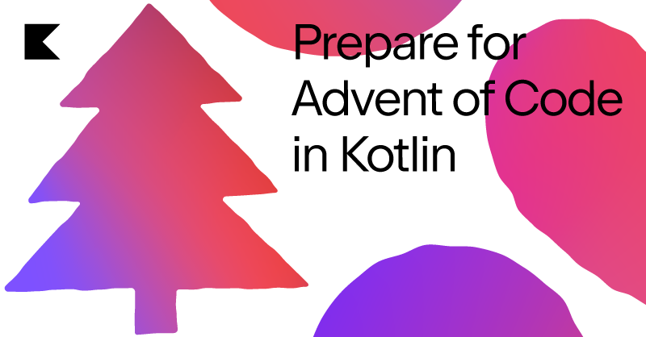

# Advent of code 2022

---

## Introduction

This is a project to participate in [AdventOfCode 2022](https://adventofcode.com/2022)

Advent of Code is an Advent calendar of small programming puzzles for a variety of skill sets and skill levels that can
be solved in any programming language you like. People use them as a speed contest, interview prep, company training,
university coursework, practice problems, or to challenge each other.



---

## Running tests

Via maven: `mvn clean test`
Also possible via the ide of your choice

---
    
## Making an executable jar

run `mvn clean package` to generate the jar with dependencies.

After generating the jar you can run the following commands to execute it:

```shell
cd target
java -jar advent-of-code-2022-1.0-SNAPSHOT-jar-with-dependencies.jar ../input
pause
```

---

## Sources

- [Powered by Kotlin and Java Banner](http://patorjk.com/software/taag/#p=display&f=Cursive&t=Powered%20by%20Kotlin%20and%20Java)
- [Advent of code 2022!](http://patorjk.com/software/taag/#p=display&f=Cursive&t=Advent%20of%20code%202022!)
